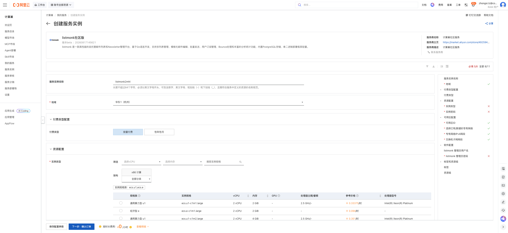
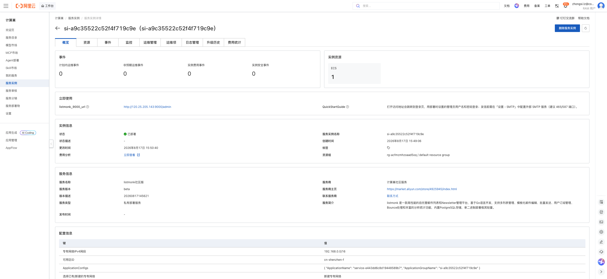
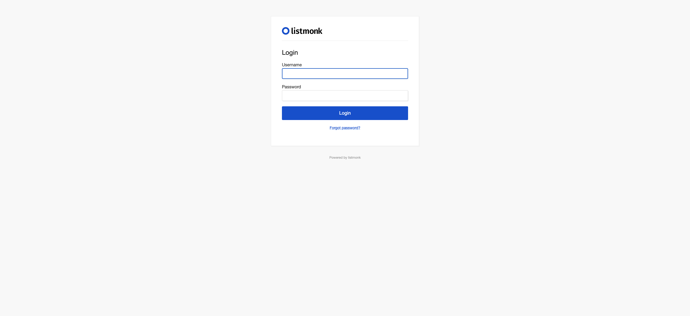

# listmonk社区版 部署文档

## 概述

listmonk社区版 是一款基于 Go 语言开发的高性能自托管邮件列表与 Newsletter 管理平台，支持多列表管理、模板化邮件编辑、批量发送、订阅者与退订管理、Bounce 处理以及丰富的分析统计功能，内置 PostgreSQL 存储。通过阿里云计算巢服务，您可以快速部署 listmonk社区版，实现开箱即用。

## 部署流程

### 1. 创建服务实例

访问 listmonk社区版 服务部署链接，按提示填写部署参数：

[部署链接](https://computenest.console.aliyun.com/service/instance/create/cn-hangzhou?type=user&ServiceId=service-e443dd6c8d19448589b7)

### 2. 确认订单并创建

参数填写完成后可以看到对应询价明细，确认参数后点击 **下一步：确认订单**。确认订单完成后同意服务协议并点击 **立即创建** 进入部署阶段。

### 3. 等待部署完成

等待部署完成后进入服务实例管理，在控制台找到 listmonk社区版 访问链接。

### 4. 访问服务

单击链接访问服务。

## 官方文档

更多信息请访问官方文档：[listmonk / Documentation](https://listmonk.app/docs/)
